# LexiSwipe

An English vocabulary learning app built with Flutter. Swipe through curated word decks (Oxford 3000/5000 and American Oxford lists), listen to pronunciations, reveal meanings and examples, and reinforce knowledge with practice and quiz modes. The app supports ads and in‑app purchases for premium features.

- English | [Türkçe](#türkçe)

## Features
- Oxford 3000 / 5000 and American Oxford word lists (bundled offline JSON assets)
- Learn mode with swipeable cards, IPA pronunciation, TTS playback, examples
- Practice mode with multiple‑choice questions and streak/hearts
- Quiz and exam modules
- Word Bank and Mistakes lists for targeted repetition
- Google Mobile Ads integration
- In‑App Purchases (Premium)
- Works on Android, iOS and Web

## Screenshots
Stored under `docs/screenshots/`:

| | | |
|---|---|---|
| 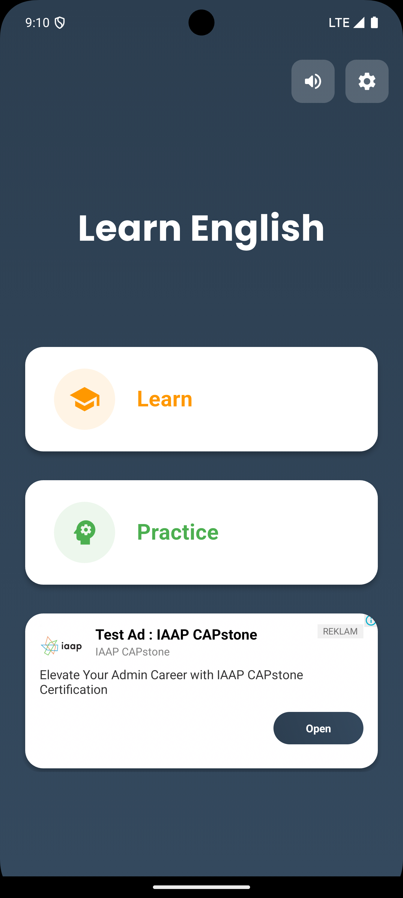<br/><sub>Home — progress, stars and hearts</sub> | 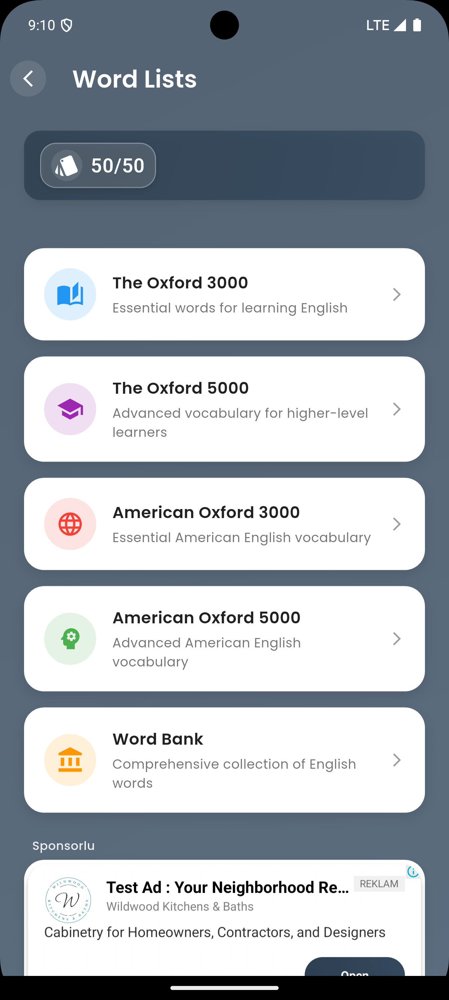<br/><sub>Word Lists — Oxford 3000/5000 & American Oxford</sub> | 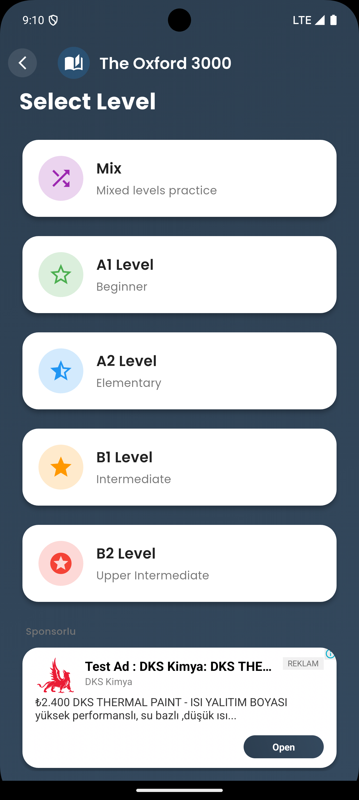<br/><sub>Levels — grouped practice sets</sub> |
| <br/><sub>Learn — swipeable card front</sub> | 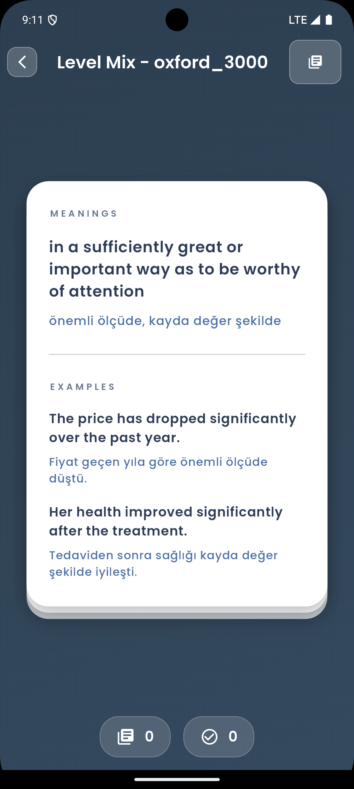<br/><sub>Details — IPA, meaning, examples, TTS</sub> | 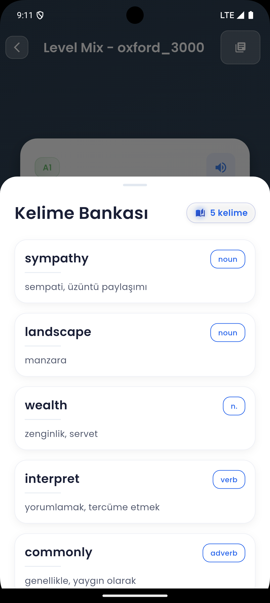<br/><sub>Word Bank — saved words and mistakes</sub> |
| 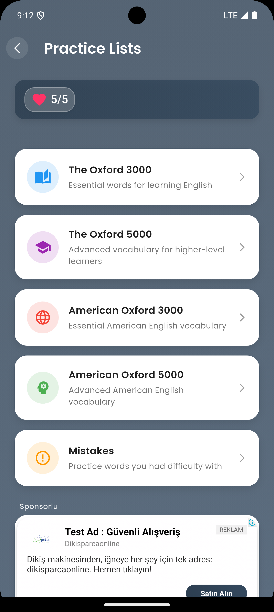<br/><sub>Practice — select lists for drills</sub> | 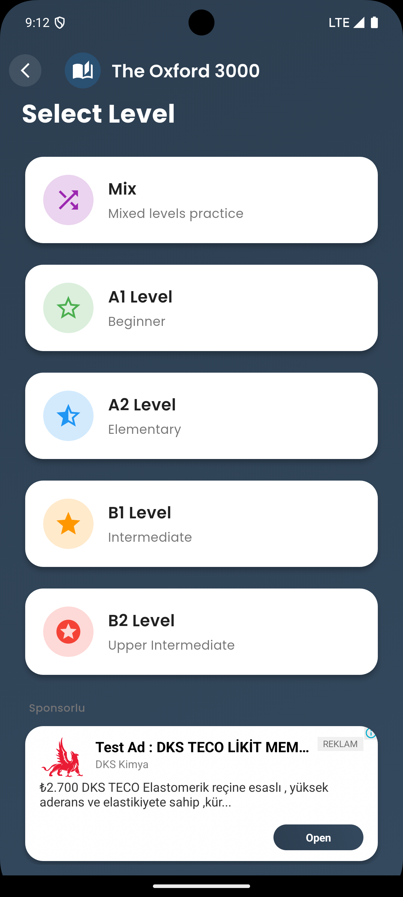<br/><sub>Levels (alt) — alternative layout</sub> | 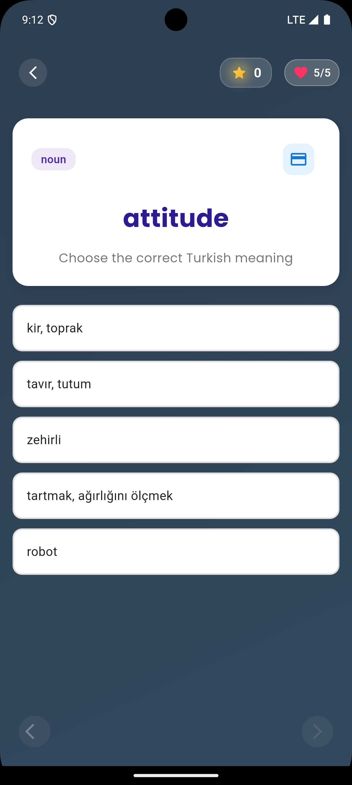<br/><sub>Quiz — multiple-choice questions</sub> |
| 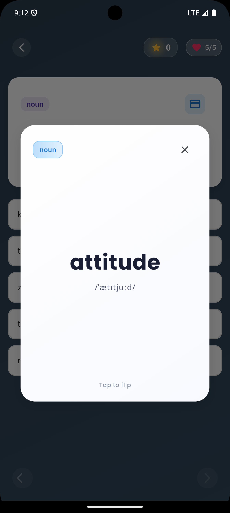<br/><sub>Flashcard Modal — quick review</sub> | 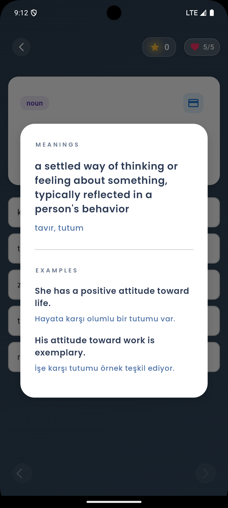<br/><sub>Word Detail Modal — meanings & examples</sub> | 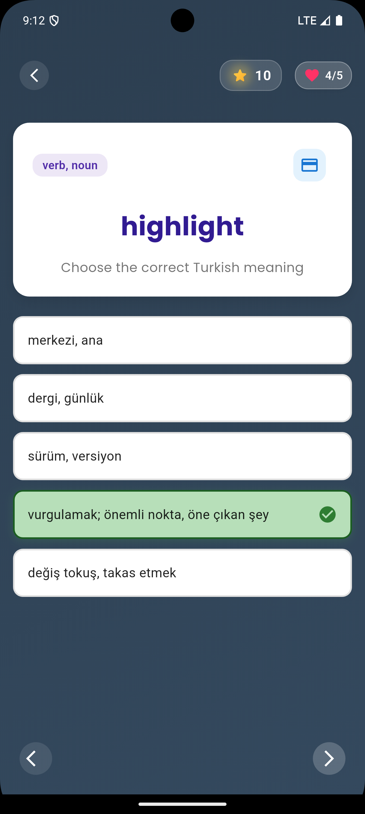<br/><sub>Quiz — correct answer feedback</sub> |

## Tech Stack
- Flutter 3 (Dart)
- State management: `provider`
- Audio: `just_audio`, `audioplayers`, `flutter_tts`
- Monetization: `google_mobile_ads`, `in_app_purchase`
- UI: `google_fonts`, `flutter_svg`, `lottie`, `card_swiper`

## Project Structure (high level)
```
lib/
  core/            # theme, constants, providers, widgets
  models/          # data models
  modules/         # feature modules: learn, practice, quiz, level, exam, etc.
  services/        # ads, premium, sound, tts, word bank
  widgets/         # shared UI components
assets/
  data/            # word list JSONs (Oxford / American Oxford)
  images/          # app icons
  sounds/          # ui/feedback sounds
docs/
  screenshots/     # screenshots used in README
```

## Getting Started
### Prerequisites
- Flutter SDK installed and on PATH
- Android Studio with Android SDK (for Android)
- Xcode (for iOS)

### Install dependencies
```
flutter pub get
```

### Run
Android emulator:
```
flutter emulators --launch <EMULATOR_ID>
flutter run -d <DEVICE_ID>
```
Commonly the Android device id looks like `emulator-5554`. List devices with:
```
flutter devices
```

iOS:
```
open ios/Runner.xcworkspace
# or
flutter run -d <iOS_SIMULATOR_ID>
```

Web:
```
flutter run -d chrome
```

### Build
Android:
```
flutter build apk --release
```

iOS:
```
flutter build ios --release
```

Web:
```
flutter build web
```

## Configuration
### Ads (Google Mobile Ads)
Provide your AdMob app id and ad unit ids in platform projects (`android/app/src/main/AndroidManifest.xml`, iOS Info.plist) if you intend to publish. Test ids are recommended during development.

### In‑App Purchases
Set up products in Play Console / App Store Connect and match the product identifiers used by the app (see `services/premium_service.dart`).

### Text‑to‑Speech / Audio
TTS and audio playback use `flutter_tts` and `just_audio`. Ensure audio permissions (Android) and proper session categories (iOS) are configured by the plugins.

## Development Notes
- Word assets are packaged under `assets/data/` and declared in `pubspec.yaml`.
- Sound effects reside in `assets/sounds/`.
- UI and theme primitives live in `lib/core/`.

## Contributing
See [CONTRIBUTING.md](CONTRIBUTING.md).

## License
Custom Proprietary License (All Rights Reserved). No public use, distribution or sharing is permitted without prior written permission from the copyright holder. See [LICENSE](LICENSE) for details.

---

## Türkçe

İngilizce kelime öğrenmeyi kolaylaştırmak için Flutter ile geliştirilmiş bir uygulama. Oxford 3000/5000 ve American Oxford listelerinden seçili kelime kartlarını kaydır, telaffuzu dinle, anlam ve örnekleri gör, ardından pratik ve quiz modlarıyla pekiştir. Uygulama reklam ve uygulama‑içi satın alma (Premium) destekler.

### Özellikler
- Oxford 3000 / 5000 ve American Oxford kelime listeleri (offline JSON)
- Kart tabanlı Learn modu, IPA telaffuz, TTS seslendirme, örnek cümleler
- Çoktan seçmeli Practice modu, seri ve canlar
- Quiz ve sınav modülleri
- Word Bank ve Mistakes listeleri ile hedefli tekrar
- Google Mobile Ads entegrasyonu
- Uygulama‑içi satın alma (Premium)
- Android, iOS ve Web desteği

### Ekran Görüntüleri
Ekran görüntüleri `docs/screenshots/` altındadır:

| | | |
|---|---|---|
| <br/><sub>Ana Ekran — ilerleme, yıldız ve canlar</sub> | <br/><sub>Kelime Listeleri — Oxford 3000/5000 ve American Oxford</sub> | <br/><sub>Seviye — gruplandırılmış pratik setleri</sub> |
| <br/><sub>Öğren — kaydırılabilir kart önü</sub> | <br/><sub>Detay — IPA, anlam, örnekler, TTS</sub> | <br/><sub>Kelime Bankası — kayıtlı kelimeler ve hatalar</sub> |
| <br/><sub>Pratik — alıştırma listeleri seçimi</sub> | <br/><sub>Seviye (alternatif) — farklı yerleşim</sub> | <br/><sub>Quiz — çoktan seçmeli sorular</sub> |
| <br/><sub>Kart Modalı — hızlı tekrar</sub> | <br/><sub>Kelime Detayı Modalı — anlamlar ve örnekler</sub> | <br/><sub>Quiz — doğru cevap geri bildirimi</sub> |

### Kurulum
Önkoşullar:
- Flutter SDK
- Android Studio + Android SDK (Android için)
- Xcode (iOS için)

Bağımlılıkları kur:
```
flutter pub get
```

Çalıştırma:
```
flutter emulators --launch <EMULATOR_ID>
flutter run -d <CIHAZ_ID>
```
`flutter devices` ile cihaz listesini görebilirsin.

Build:
```
flutter build apk --release
flutter build ios --release
flutter build web
```

### Yapı ve Konfigürasyon
- Reklamlar için AdMob kimliklerini platform proje ayarlarına ekle.
- Uygulama‑içi satın almalar için mağaza ürünlerini tanımlayıp uygulamadaki kimliklerle eşleştir.
- TTS ve ses çalma için ilgili izinlerin ve ayarların etkin olduğundan emin ol.

### Katkı
[CONTRIBUTING.md](CONTRIBUTING.md) belgesini inceleyebilirsin.

### Lisans
Özel ve kısıtlayıcı lisans (All Rights Reserved). Hak sahibinin yazılı izni olmadan kamuya açık kullanım, paylaşım veya dağıtıma izin verilmez. Ayrıntılar için [LICENSE](LICENSE).
