<div align="center">

# 📚 LexiSwipe

### Kaydırılabilir Kartlarla İngilizce Kelime Öğrenin

[](https://flutter.dev)
[](#)
[](LICENSE)

### [▶ Canlı Demoyu Deneyin](https://lexiswipe.vercel.app)

Uygulamayı doğrudan tarayıcınızda deneyimleyin — kartları kaydırın, quiz çözün ve telaffuzu dinleyin.

[English](README.md) • [Türkçe](#-genel-bakış)

</div>

---

## 🎯 Genel Bakış

**LexiSwipe**, Flutter ile geliştirilmiş kapsamlı bir İngilizce kelime öğrenme uygulamasıdır. Kullanıcıların temel İngilizce kelimeleri eğlenceli ve kaydırma tabanlı bir arayüz ile öğrenmelerine yardımcı olmak için tasarlanmıştır. Uygulama, **Oxford 3000/5000** ve **American Oxford** koleksiyonlarından seçilmiş kelime listelerini, interaktif öğrenme modlarını, telaffuz desteğini ve oyunlaştırılmış pratik oturumlarını bir araya getirir.

İster dil sınavlarına hazırlanıyor olun, ister günlük İngilizcenizi geliştirin veya profesyonel kelime dağarcığınızı oluşturun, LexiSwipe Android, iOS ve Web platformlarında yapılandırılmış, verimli ve keyifli bir öğrenme deneyimi sunar.

---

## ✨ Temel Özellikler

### 📖 Kapsamlı Kelime Listeleri
- **Oxford 3000 & 5000**: Öğrenciler için temel ve genişletilmiş kelime dağarcığı
- **American Oxford 3000 & 5000**: Amerikan İngilizcesi varyantları
- **Çevrimdışı Erişim**: Tüm kelime listeleri JSON varlıkları olarak paketlenmiştir—internet gerekmez
- **CEFR Seviyeleri**: Kelimeler yeterlilik düzeyine göre organize edilmiştir (A1, A2, B1, B2, C1)

### 🎴 İnteraktif Öğrenme Modu
- **Kaydırılabilir Kartlar**: Kelime dağarcığında sezgisel jest tabanlı gezinme
- **IPA Telaffuz**: Doğru telaffuz için Uluslararası Fonetik Alfabe
- **Sesli Okuma (TTS)**: Tek dokunuşla ana dili konuşan kişinin telaffuzunu dinleyin
- **Bağlamsal Örnekler**: Kelime kullanımını gösteren gerçek dünya cümleleri
- **Kelime Türü**: Her kelime için net dilbilgisel sınıflandırma

### 🎯 Pratik & Değerlendirme
- **Çoktan Seçmeli Quizler**: Hedeflenmiş sorularla bilginizi test edin
- **Seri Sistemi**: Ardışık doğru cevapları takip edin ve ivme kazanın
- **Can Mekanizması**: Odaklanmayı sürdürmek için oyunlaştırılmış can sistemi
- **Sınav Modu**: İlerlemeyi değerlendirmek için kapsamlı değerlendirmeler
- **Anında Geri Bildirim**: Detaylı açıklamalarla anında düzeltme

### 💾 Kişiselleştirilmiş Öğrenme
- **Kelime Bankası**: Daha sonra gözden geçirmek ve odaklanmış çalışma için kelimeleri kaydedin
- **Hatalar Listesi**: Hedefli pratik için hataları otomatik olarak takip edin
- **İlerleme Takibi**: Yıldızlar ve istatistiklerle öğrenme yolculuğunuzu izleyin
- **Özel Pratik Setleri**: Kayıtlı kelimelerden kişiselleştirilmiş alıştırmalar oluşturun

### 🎨 Modern Kullanıcı Deneyimi
- **Güzel Arayüz**: Pürüzsüz animasyonlarla temiz, modern arayüz
- **Karanlık Mod Desteği**: Her aydınlatma koşulunda rahat öğrenme
- **Duyarlı Tasarım**: Telefonlar, tabletler ve web tarayıcıları için optimize edilmiş
- **Sezgisel Navigasyon**: Tüm özelliklere ve modlara kolay erişim

### 💰 Monetizasyon & Premium
- **Google Mobile Ads**: Rahatsız etmeyen reklam entegrasyonu
- **Uygulama İçi Satın Almalar**: Gelişmiş deneyim için isteğe bağlı premium özellikler
- **Reklamsız Seçenek**: Premium kullanıcılar kesintisiz öğrenmenin keyfini çıkarır

---

## 📱 Ekran Görüntüleri

<div align="center">

### 🏠 Ana Sayfa & Navigasyon
<table>
  <tr>
    <td align="center" width="33%">
      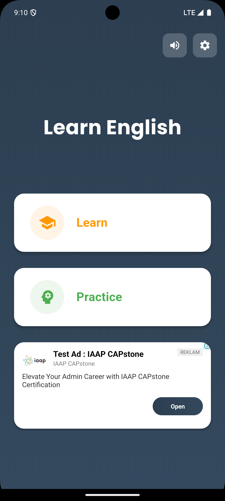
      <br />
      <sub><b>Ana Ekran</b></sub>
      <br />
      <sub>Yıldız, can ve serilerle ilerlemenizi takip edin. Öğren, Pratik ve Kelime Bankası modlarına hızlı erişim.</sub>
    </td>
    <td align="center" width="33%">
      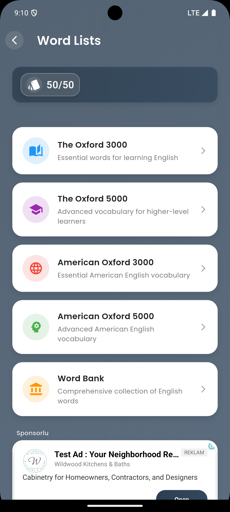
      <br />
      <sub><b>Kelime Listeleri</b></sub>
      <br />
      <sub>Oxford 3000, Oxford 5000, American Oxford 3000/5000 veya kişiselleştirilmiş Kelime Bankanız arasından seçim yapın.</sub>
    </td>
    <td align="center" width="33%">
      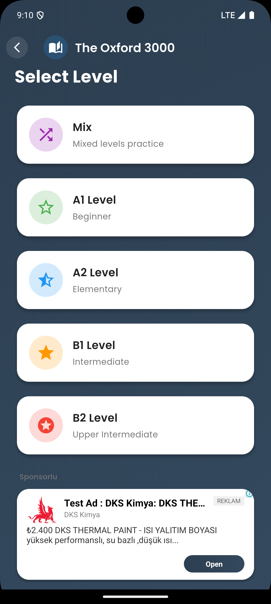
      <br />
      <sub><b>Seviye Seçimi</b></sub>
      <br />
      <sub>Zorluk seviyelerini (Mix, A1, A2, B1, B2) seçin, CEFR yeterlilik standartlarına göre gruplandırılmış pratik setleri.</sub>
    </td>
  </tr>
</table>

### 📚 Öğrenme Modu
<table>
  <tr>
    <td align="center" width="33%">
      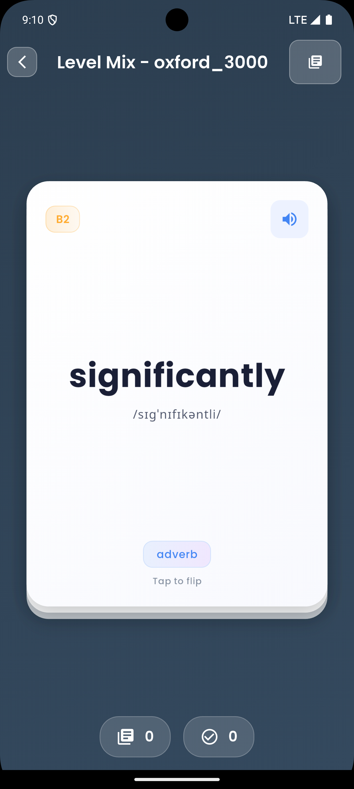
      <br />
      <sub><b>Kaydırılabilir Kart</b></sub>
      <br />
      <sub>Pürüzsüz animasyonlarla kelime kartlarını kaydırın. Detaylı bilgileri görmek için dokunun ve çevirin.</sub>
    </td>
    <td align="center" width="33%">
      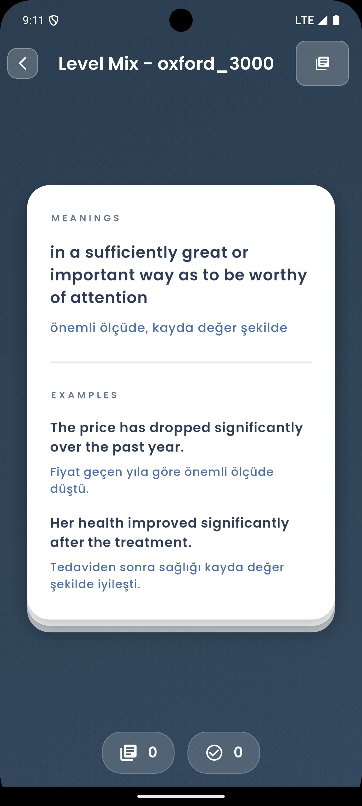
      <br />
      <sub><b>Kelime Detayları</b></sub>
      <br />
      <sub>IPA telaffuz, kelime türü, Türkçe çeviriler ve TTS sesli okuma ile örnek cümleleri görüntüleyin.</sub>
    </td>
    <td align="center" width="33%">
      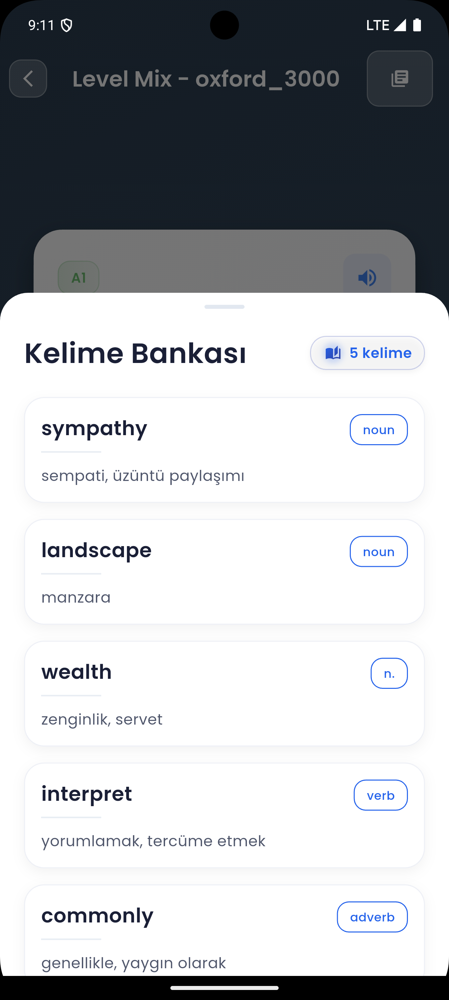
      <br />
      <sub><b>Kelime Bankası</b></sub>
      <br />
      <sub>Kayıtlı kelimeleri ve hataları gözden geçirin. Hedefli pratik oturumları için kişiselleştirilmiş kelime listenizi oluşturun.</sub>
    </td>
  </tr>
</table>

### 🎯 Pratik & Quiz
<table>
  <tr>
    <td align="center" width="33%">
      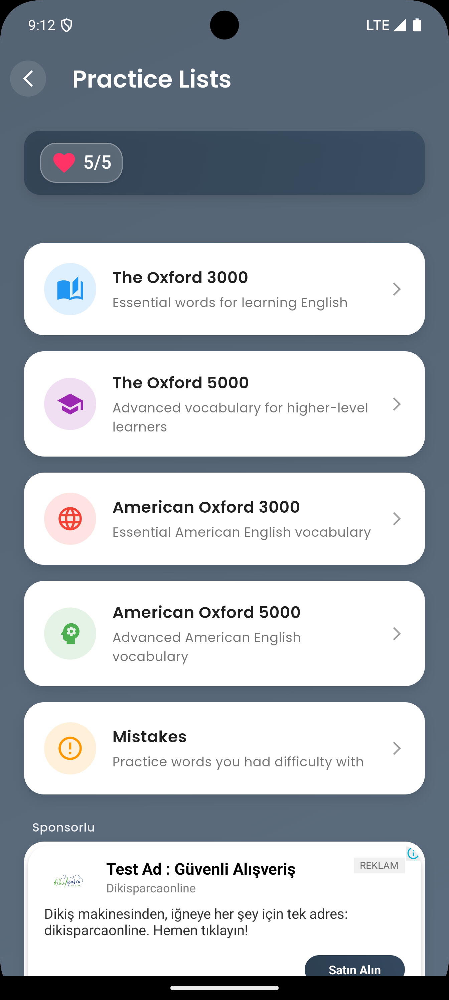
      <br />
      <sub><b>Pratik Modu</b></sub>
      <br />
      <sub>Çoktan seçmeli alıştırmalar için kelime listeleri seçin. Kelime pratiği yaparken seri kazanın ve canlarınızı koruyun.</sub>
    </td>
    <td align="center" width="33%">
      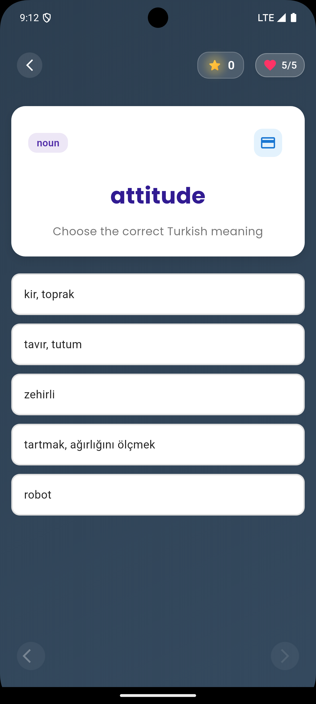
      <br />
      <sub><b>Quiz Sorusu</b></sub>
      <br />
      <sub>Özenle hazırlanmış çoktan seçmeli sorularla bilginizi test edin. Doğru çeviriyi seçin.</sub>
    </td>
    <td align="center" width="33%">
      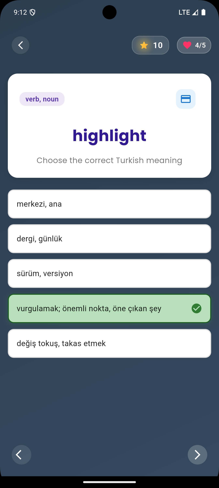
      <br />
      <sub><b>Cevap Geri Bildirimi</b></sub>
      <br />
      <sub>Yeşil renkle vurgulanan doğru cevaplarla anında geri bildirim alın. Puanınızı ve ilerlemenizi gerçek zamanlı takip edin.</sub>
    </td>
  </tr>
</table>

### 💡 Hızlı İnceleme Modalları
<table>
  <tr>
    <td align="center" width="50%">
      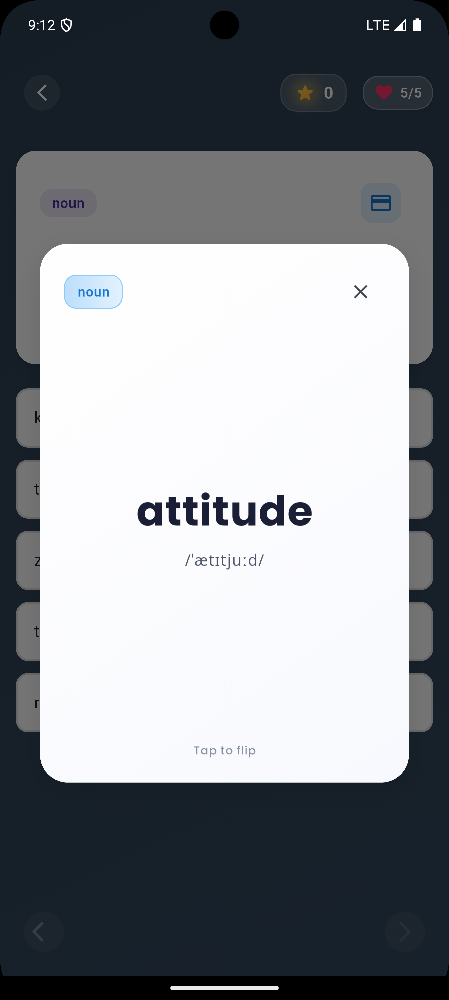
      <br />
      <sub><b>Kart Modalı</b></sub>
      <br />
      <sub>Hızlı öğrenme ve tekrar için kelime anlamlarını ve örnek cümleleri gösteren hızlı inceleme popup'ı.</sub>
    </td>
    <td align="center" width="50%">
      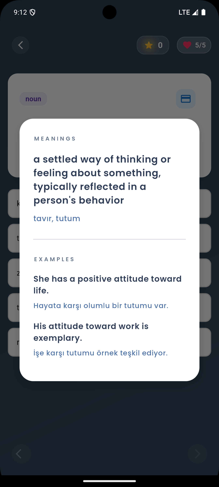
      <br />
      <sub><b>Kelime Detay Modalı</b></sub>
      <br />
      <sub>Telaffuz kılavuzları, anlamlar ve bağlamsal örneklerle kapsamlı kelime bilgisi modalı.</sub>
    </td>
  </tr>
</table>

</div>

---

## 🛠️ Teknoloji Yığını

### Temel Framework
- **Flutter 3.x** - Çapraz platform UI framework'ü
- **Dart** - Programlama dili

### Durum Yönetimi
- **Provider** - Hafif ve verimli durum yönetimi

### Ses & Konuşma
- **just_audio** - Yüksek performanslı ses çalma
- **audioplayers** - Ek ses yetenekleri
- **flutter_tts** - Metinden Konuşmaya sentezi

### Monetizasyon
- **google_mobile_ads** - Google AdMob entegrasyonu
- **in_app_purchase** - Premium özellikler ve abonelikler

### UI & Tasarım
- **google_fonts** - Güzel tipografi
- **flutter_svg** - Ölçeklenebilir vektör grafikleri
- **lottie** - Pürüzsüz animasyonlar
- **card_swiper** - Kaydırılabilir kart arayüzü

---

## 📂 Proje Yapısı

```
lib/
├── core/
│   ├── constants/        # Uygulama genelinde sabitler ve yapılandırma
│   ├── providers/        # Durum yönetimi sağlayıcıları
│   ├── theme/           # Tema verileri ve stil
│   └── widgets/         # Yeniden kullanılabilir temel widget'lar
├── models/
│   └── word_model.dart  # Kelime dağarcığı için veri modelleri
├── modules/
│   ├── exam/           # Sınav ve değerlendirme özellikleri
│   ├── home/           # Ana ekran ve navigasyon
│   ├── learn/          # Kartlarla öğrenme modu
│   ├── level/          # Seviye seçimi ve yönetimi
│   ├── onboarding/     # İlk kullanıcı deneyimi
│   ├── practice/       # Quizlerle pratik modu
│   └── quiz/           # Quiz fonksiyonalitesi
├── services/
│   ├── ad_service.dart              # Google Ads entegrasyonu
│   ├── premium_service.dart         # Uygulama içi satın alma işleme
│   ├── sound_service.dart           # Ses efektleri yönetimi
│   ├── text_to_speech_service.dart  # TTS fonksiyonalitesi
│   └── word_bank_service.dart       # Kelime Bankası kalıcılığı
├── utils/
│   └── color_palette.dart           # Renk tanımlamaları
├── widgets/
│   ├── cards_indicator.dart         # İlerleme göstergeleri
│   ├── hearts_indicator.dart        # Can gösterimi
│   ├── score_indicator.dart         # Puan takibi
│   └── word_card_dialog.dart        # Kelime detay modalları
└── main.dart                        # Uygulama giriş noktası

assets/
├── data/
│   ├── American_Oxford_3000.json    # Amerikan İngilizcesi kelime dağarcığı
│   ├── American_Oxford_5000.json
│   ├── The_Oxford_3000.json         # İngiliz İngilizcesi kelime dağarcığı
│   ├── The_Oxford_5000.json
│   └── wordbank.json                # Kullanıcının kayıtlı kelimeleri
├── images/                          # Uygulama ikonları ve görselleri
└── sounds/                          # UI ses efektleri

docs/
└── screenshots/                     # README için uygulama ekran görüntüleri
```

---

## 🚀 Başlarken

### Ön Koşullar

Başlamadan önce, aşağıdakilerin yüklü olduğundan emin olun:

- **Flutter SDK** (3.0 veya üzeri) - [Kurulum Kılavuzu](https://docs.flutter.dev/get-started/install)
- **Dart SDK** (Flutter ile birlikte gelir)
- **Android Studio** ve Android SDK (Android geliştirme için)
- **Xcode** (iOS geliştirme için, yalnızca macOS)
- **Git** versiyon kontrolü için

### Kurulum

1. **Depoyu klonlayın**
   ```bash
   git clone https://github.com/YusufAlper17/LexiSwipe.git
   cd LexiSwipe
   ```

2. **Bağımlılıkları yükleyin**
   ```bash
   flutter pub get
   ```

3. **Flutter kurulumunu doğrulayın**
   ```bash
   flutter doctor
   ```
   Devam etmeden önce Flutter Doctor tarafından bildirilen sorunları çözün.

### Uygulamayı Çalıştırma

#### Android
```bash
# Mevcut cihazları listeleyin
flutter devices

# Bir emülatör başlatın
flutter emulators --launch <EMULATOR_ID>

# Uygulamayı çalıştırın
flutter run -d <DEVICE_ID>
```

Yaygın Android cihaz ID formatı: `emulator-5554`

#### iOS (yalnızca macOS)
```bash
# Xcode workspace'i açın
open ios/Runner.xcworkspace

# Veya doğrudan çalıştırın
flutter run -d <iOS_SIMULATOR_ID>
```

#### Web
```bash
flutter run -d chrome
```

### Üretim için Derleme

#### Android APK
```bash
flutter build apk --release
```
Çıktı: `build/app/outputs/flutter-apk/app-release.apk`

#### Android App Bundle (Play Store için)
```bash
flutter build appbundle --release
```
Çıktı: `build/app/outputs/bundle/release/app-release.aab`

#### iOS
```bash
flutter build ios --release
```
Ardından arşivlemek ve App Store'a yüklemek için Xcode'u açın.

#### Web
```bash
flutter build web --release
```
Çıktı: `build/web/`

---

## ⚙️ Yapılandırma

### Google Mobile Ads

1. **AdMob Uygulama ID'sini** [Google AdMob Konsolu](https://admob.google.com/)'ndan alın

2. **Android Yapılandırması**
   
   `android/app/src/main/AndroidManifest.xml` dosyasını düzenleyin:
   ```xml
   <meta-data
       android:name="com.google.android.gms.ads.APPLICATION_ID"
       android:value="ca-app-pub-XXXXXXXXXXXXXXXX~XXXXXXXXXX"/>
   ```

3. **iOS Yapılandırması**
   
   `ios/Runner/Info.plist` dosyasını düzenleyin:
   ```xml
   <key>GADApplicationIdentifier</key>
   <string>ca-app-pub-XXXXXXXXXXXXXXXX~XXXXXXXXXX</string>
   ```

4. **Reklam Birimi ID'lerini Güncelleyin** `lib/services/ad_service.dart` dosyasında

> **Not**: Politika ihlallerinden kaçınmak için geliştirme sırasında test reklam ID'lerini kullanın.

### Uygulama İçi Satın Almalar

1. **Google Play Console**
   - Play Console'da ürünler oluşturun
   - Ürün ID'lerini not edin (örn. `premium_monthly`, `premium_yearly`)

2. **App Store Connect**
   - Uygulama içi satın alma ürünleri oluşturun
   - Ürün ID'lerini Android ile eşleştirin

3. **Ürün ID'lerini Güncelleyin** `lib/services/premium_service.dart` dosyasında

### Metinden Konuşmaya & Ses

- **Android**: Ses izinleri eklentiler tarafından otomatik olarak yapılandırılır
- **iOS**: `Info.plist` dosyasında uygun ses oturumu kategorilerini sağlayın
- **Çevrimdışı TTS**: Bazı TTS sesleri ilk kullanımda indirme gerektirebilir

---

## 🧪 Test Etme

Birim ve widget testlerini çalıştırın:
```bash
flutter test
```

Entegrasyon testlerini çalıştırın:
```bash
flutter test integration_test
```

---

## 🤝 Katkıda Bulunma

Topluluktan gelen katkıları memnuniyetle karşılıyoruz! Pull request göndermeden önce lütfen [Katkıda Bulunma Kılavuzumuzu](CONTRIBUTING.md) okuyun.

### Geliştirme İş Akışı

1. Depoyu fork edin
2. Bir özellik dalı oluşturun (`git checkout -b feature/harika-ozellik`)
3. Değişikliklerinizi commit edin (`git commit -m 'Harika özellik ekle'`)
4. Dala push edin (`git push origin feature/harika-ozellik`)
5. Bir Pull Request açın

### Kod Stili

- [Effective Dart](https://dart.dev/guides/language/effective-dart) kılavuzlarını takip edin
- Commit etmeden önce `flutter analyze` çalıştırın
- Kodu `flutter format .` ile biçimlendirin

---

## 📄 Lisans

**Özel Mülkiyet Lisansı** - Tüm Hakları Saklıdır

Bu proje özel yazılımdır. Telif hakkı sahibinden önceden yazılı izin alınmadan kamuya açık kullanım, dağıtım, değiştirme veya paylaşıma izin verilmez.

Tam detaylar için [LICENSE](LICENSE) dosyasına bakın.

---

## 📞 Destek & İletişim

- **Sorunlar**: [GitHub Issues](https://github.com/YusufAlper17/LexiSwipe/issues)
- **E-posta**: support@lexiswipe.com
- **Web Sitesi**: [www.lexiswipe.com](https://www.lexiswipe.com)

---

## 🌟 Teşekkürler

- **Oxford University Press** Oxford 3000/5000 kelime listeleri için
- **Flutter Ekibi** harika framework için
- **Açık Kaynak Topluluğu** bu projede kullanılan mükemmel paketler için

---

<div align="center">

**Flutter ile ❤️ ile yapıldı**

[⬆ Başa Dön](#-lexiswipe)

</div>

